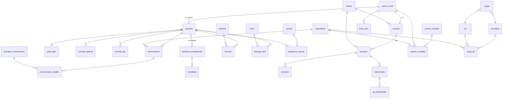

# Panel de Control GTEC — Modelo de datos para la migración

Versión 0.1 · 14-09-2026 · Fuente analizada: `Panel de Control GTEC (2).xlsb` (75 hojas, 50 MB)

Este documento traduce las hojas seleccionadas del Excel a un modelo relacional. Es la base para el
`models.py` de Django y para el script de migración inicial. Las hojas marcadas **NO** por el
equipo quedan fuera; las que no aparecieron en la lista se anotan como pendientes al final.

---

## 1. Principios de diseño

1. **Una entidad, una tabla.** Hoy "Persona" está repetida en 11 hojas con tres formatos de RUT
   distintos (`007.932.663-1`, `7.932.663-1`, `7932663-1`) y nombres en distinto orden. En la base
   hay una sola tabla `persona` y todas las demás la referencian por clave.
2. **Matrices anchas pasan a formato largo.** Vacaciones (386 columnas), Roster (402), Primavera
   (130), Libro Remuneraciones (198), Licencias, EPP, Presupuesto y Metas tienen una columna por
   día, semana, mes, software o ítem. En la base son filas: `(persona, fecha, valor)`.
3. **Las hojas derivadas no son tablas.** TD GAF, Análisis Rem, Análisis Reclutamiento, Índice
   Semanal/Mensual, Disciplina Semanal/Mensual, HH Disciplina, Carga Laboral y Gráficos son
   cálculos sobre otras hojas. Pasan a ser consultas, vistas SQL o páginas de Power BI.
4. **Duplicados por año se unifican.** Analisis Rem 2023/24/25, Proyección 2023/24/25, Roster
   2025/26, Metas y Presupuesto 2024 se convierten en una tabla con columna `anio` (o `fecha`).
5. **Los parámetros salen de las celdas sueltas.** HH semanales disponibles (37), HH mensuales
   (148), factor productividad (0,9), costo empresa (0,35), monto diario alimentación (5.800) van a
   una tabla `parametro` con vigencia.
6. **Toda importación deja rastro.** La celda "Fecha de Actualización" de cada hoja se reemplaza por
   `actualizado_en` en cada fila y una tabla `importacion` que registra quién cargó qué archivo y
   cuándo.

---

## 2. Mapa hoja → destino

| Hoja Excel | Decisión equipo | Destino en la base | Tipo |
|---|---|---|---|
| Inicio | SI | Página de inicio de la app (4 accesos: Personal, Gestiones, Proyectos, Financiero) | UI |
| Apuntes | SI | `portal` (solo nombre, URL y observación; **sin credenciales**) | Catálogo |
| Cargos GING | SI | `cargo`, `disciplina`, `rol` | Catálogo |
| Personal GING | SI | `persona` + `perfil_gtec` | Maestro |
| Personal Contratos | SI | `persona` (con CC de contrato) | Maestro |
| Personal Histórico | SI | `contrato_laboral` (ingreso, desvinculación, motivo) | Historial |
| DotacionRRHH | SI | `persona` (toda la empresa) + `contrato_laboral` | Maestro / importado |
| Vacaciones | SI | `jornada_dia` (código V / L / P por día) | Hecho diario |
| Roster 2026 | SI | `jornada_dia` (código O / T por día) | Hecho diario |
| Libro Remuneraciones | SI | `remuneracion` + `remuneracion_detalle` + `concepto_remuneracion` | Hecho mensual / importado |
| Analisis Rem 2023 | SI (2024/25 NO) | Vista: suma mensual por CC desde `remuneracion` | Vista |
| EPP | SI | `entrega_item` + `item` (tipo EPP) + tallas en `perfil_gtec` | Hecho |
| Licencias Softwares | SI | `licencia` + `software` | Hecho |
| Puestos Oficina | SI | `puesto`, `asignacion_puesto`, `casillero` | Maestro |
| Organigrama | SI | Imagen adjunta o vista generada desde `persona.reporta_a` | UI |
| Reclutamiento | SI | `solicitud_reclutamiento` + `candidato` | Hecho |
| Análisis Reclutamiento | SI | Vista: conteo por estado | Vista |
| CttosGTEC | SI | `contrato` | Maestro |
| Proyectos GTEC | SI | `proyecto` + `provision` | Maestro / hecho |
| Proyectos Finalizados | SI | `proyecto` con `estado = FINALIZADO` | Maestro |
| Activos | SI | `contrato` (todas las gerencias, con flag `es_gte`) | Maestro |
| Subcontratos | SI | `subcontrato` + `ep_subcontrato` | Hecho |
| BBDD GAF | SI | `asiento_contable` + `cuenta_contable` | Hecho / importado |
| TD GAF | SI | Vista: saldo por año, mes y área | Vista |
| Proyección (Base/Ventas) | SI | `linea_plan` con `tipo = PROYECCION` | Hecho mensual |
| Metas 2024 | SI | `linea_plan` con `tipo = META` | Hecho mensual |
| Presupuesto 2024 | SI | `linea_plan` con `tipo = PRESUPUESTO` | Hecho mensual |
| Primavera Semanal / Mensual | SI | `carga_p6` | Hecho / importado |
| Índice Semanal / Mensual | SI | Vista: HH / (dotación × HH disponibles) por cargo | Vista |
| Disciplina Semanal / Mensual | SI | Vista: igual, agrupado por disciplina | Vista |
| Carga Laboral 2024, Gráficos CL | SI | Vista con filtros (rango, disciplina) + gráficos | Vista |
| USD UF | NO | Ver pendiente P1 | — |
| Requisiciones | NO | Se guarda solo el N° como texto en `subcontrato` | — |
| BBDD Carga HH, TD HH Cargadas | NO | Fuera de alcance | — |
| EP GTEC, EP GAF | NO | Fuera de alcance | — |
| LOG (19 hojas) | NO | Fuera de alcance | — |
| Libro Remuneraciones 2025 | NO | Ver pendiente P2 | — |

---

## 3. Entidades

Notación: `PK` clave primaria, `FK` clave foránea, `?` opcional. Tipos en términos genéricos
(Django entre paréntesis cuando no es obvio).

### 3.1 Catálogos y parámetros

**`centro_costo`** — el "CC" que aparece en todas las hojas.
| campo | tipo | nota |
|---|---|---|
| codigo `PK` | char(10) | normalizado a `116`, `199`, `572`. Hoy aparece como `116`, `1-16`, `116-GTE` |
| nombre | varchar | "Gerencia Técnica" |
| gerencia | varchar | GTE, GAF, GOP… |
| es_gte | bool | equivale a la columna GTE Si/No de Activos y DotacionRRHH |
| activo | bool | |

**`disciplina`**, **`rol`**, **`cargo`** — desde Cargos GING.
- `cargo(id PK, nombre, rol FK, disciplina FK)`. 81 cargos, 20 disciplinas aprox.

**`cliente`** — `id, nombre, nombre_estandar` ("Codelco- División RT", "MOLINO LA ESTAMPA S.A.").

**`parametro`** — `clave PK, valor decimal, vigente_desde date, descripcion`.
Valores iniciales: `HH_SEMANA=37`, `HH_MES=148`, `FACTOR_PRODUCTIVIDAD=0.9`,
`COSTO_EMPRESA=0.35`, `ADICIONAL_COSTO_EMPRESA=0.15`, `MONTO_DIARIO_ALIMENTACION=5800`.

**`portal`** — desde Apuntes: `nombre, url, observacion, responsable FK persona?`.
Los campos usuario y clave **no se migran**.

**`cuenta_contable`** — `codigo PK (51010101), nombre, area (1-PERSONAL…), clasificacion, descripcion`.
Reemplaza las columnas V–AB de BBDD GAF, que hoy se rellenan a mano fila por fila.

**`software`** — `id, nombre` (AEC Collection, Adobe PDF Pro, Autocad, Revit, BIM Pro, SAP 2000,
Ondac, Sketch Up, Primavera, Power BI).

**`item`** — `id, nombre, tipo` con tipo ∈ {EPP, KIT_ERGONOMICO, KIT_BIENVENIDA, EQUIPO_PUESTO}.
Une EPP, Seg EPP, Inventario Profesionales e Inventario Oficina en un solo catálogo.

### 3.2 Personas

**`persona`** — una fila por trabajador de la empresa (fuente principal: DotacionRRHH, 2.376 filas).
| campo | tipo | nota |
|---|---|---|
| rut `PK` | char(10) | dígitos + DV, sin puntos ni guion: `7932663-1` → `79326631`. Se guarda además `rut_formateado` |
| usuario | varchar unique? | `sparada`, `ricardo.sapiain`. Vacío para personal sin cuenta |
| nombres, apellidos | varchar | separar el nombre único que hoy viene como "Pérez Soto Juan" o "Juan Pérez Soto" |
| correo | email? | |
| fecha_ingreso | date | |
| cc_actual `FK` | centro_costo | |
| cargo_actual `FK`? | cargo | |
| reporta_a `FK`? | persona | permite generar el organigrama |
| estado | enum | ACTIVO / DESVINCULADO |
| es_gtec | bool | |

**`perfil_gtec`** — atributos que solo existen para el personal de la gerencia (Personal GING).
`persona FK PK, turno (5x2), modalidad_oficina_teletrabajo (5/0, 2/3), carta_aviso?, valor_hh decimal,
gasto_general_pct, utilizacion_externa_pct, total_haberes_ponderado, talla_ropa, talla_zapato`.

**`contrato_laboral`** — historial (Personal Histórico + vencimientos de DotacionRRHH).
`id, persona FK, cc FK, cargo FK, tipo_contrato (Indefinido/Plazo fijo), fecha_inicio, fecha_termino?,
fecha_desvinculacion?, motivo_desvinculacion?, observacion (carta aviso)`.

**`jornada_dia`** — reemplaza Vacaciones y Roster (ambas son grillas persona × día).
| campo | tipo | nota |
|---|---|---|
| persona `FK` | | |
| fecha | date | |
| codigo | enum | O oficina, T teletrabajo, V vacaciones, L licencia, P permiso |
| PK compuesta | (persona, fecha) | |

De aquí salen: días de vacaciones por mes ("Días no disponible"), días en oficina para
alimentación (`O × MONTO_DIARIO_ALIMENTACION`) y "días para recarga".
Volumen: ~90 personas × 365 días ≈ 33 mil filas/año. Trivial para una base de datos.

### 3.3 Remuneraciones

El Libro tiene 198 columnas, de las cuales más de 100 están siempre en cero y otras 60 son un
segundo bloque "normalizado" que repite el primero (columnas L–DU vs DW–GP). Se modela así:

**`remuneracion`** — cabecera mensual por persona (6.139 filas hoy, 43 meses).
`id, persona FK, periodo date (primer día del mes), cc FK, dias_trabajados, total_imponible,
total_no_imponible, total_haberes, total_descuentos, liquido, total_haberes_ponderado, importacion FK`.

**`concepto_remuneracion`** — catálogo de los ~150 conceptos.
`codigo PK, nombre, tipo ∈ {HABER_IMPONIBLE, HABER_NO_IMPONIBLE, DESCUENTO_LEGAL, DESCUENTO_OTRO,
APORTE_EMPLEADOR}, activo`.

**`remuneracion_detalle`** — solo los conceptos con monto distinto de cero.
`remuneracion FK, concepto FK, monto`. PK compuesta.

Con esto el Análisis Rem (monto mensual, dotación, porcentaje) es una consulta de tres líneas y
agregar un concepto nuevo no requiere agregar una columna.

### 3.4 Dotación de recursos y equipamiento

**`licencia`** — `persona FK, software FK, fecha_vencimiento?, cantidad, comentario`.
El cuadro "situaciones más urgentes" (prioridades 1–5 por días a expiración) es una vista.

**`entrega_item`** — `persona FK, item FK, fecha_entrega?, estado (Tiene / No / -), cantidad`.
Cubre EPP, Seg EPP y kits.

**`puesto`** — `id, piso (5 / 8), numero, activo` · **`equipamiento_puesto`** — `puesto FK, item FK, estado`.
**`asignacion_puesto`** — `puesto FK, dia_semana (1–5), persona FK?, texto_libre?` (hoy hay celdas como
"Control de Gestión" o "Intercalado" que no son personas).
**`casillero`** — `numero, persona_1 FK?, persona_2 FK?, tiene_llave, comentario`.

### 3.5 Reclutamiento

La hoja usa bloques de 4 filas (1 solicitud + 3 candidatos) que el macro `NuevaSolicitudCaja` inserta.
Se separa en dos tablas:

**`solicitud_reclutamiento`** — `id, n_solicitud (Open Ágora), cc FK, cargo_solicitado, solicitante FK persona,
fecha_solicitud, estado ∈ {Activa, Finalizada, Congelada, Descartada}, etapa (Reclutamiento y selección /
Contratación), observacion`.

**`candidato`** — `solicitud FK, orden (1–3, sin tope), nombre, preseleccionado bool, observacion`.

Análisis Reclutamiento = `GROUP BY estado`.

### 3.6 Contratos y proyectos

**`contrato`** — une CttosGTEC (30 filas, detalle GTEC) y Activos (124 filas, toda la empresa).
| campo | nota |
|---|---|
| cc `FK PK` | centro_costo |
| cc_espejo `FK`? | columna "CC Espejo" |
| nombre, cliente `FK`, mandante_estandar, n_contrato_cliente (4600017862) | |
| tipo ∈ {PROYECTO_INGENIERIA, CONTRATO_INDEPENDIENTE, CONTRATO_POR_ODS} | |
| estado ∈ {ACTIVO, NO_ACTIVO}, estatus_financiero | |
| ficha_contrato (archivo), fecha_ficha | |
| administrador_jej `FK` persona, administrador_cliente, gerente `FK` persona | |
| fecha_inicio, fecha_termino_inicial, fecha_termino_actual, fecha_termino_final | |
| moneda ∈ {CLP, UF, USD}, monto_marco, monto_adjudicado, saldo_marco (calculado) | |
| cantidad_empresas, factor_contrato_pct, dotacion, responsabilidad_gte (texto) | |
| ubicacion, gerencia_responsable `FK`, es_gte bool | |

**`proyecto`** — Proyectos GTEC + Proyectos Finalizados (una ODS o servicio dentro de un contrato).
| campo | nota |
|---|---|
| id `PK`, contrato `FK` (cc), ods varchar? (NA cuando es contrato independiente) | |
| nombre, cliente `FK`, jefe_proyecto `FK` persona, jefe_proyecto_cliente | |
| estado ∈ {ACTIVO, VENCIDO, FINALIZADO}, tiene_log bool, reporte_final (archivo)? | |
| dotacion_gtec int, noc_interna bool, fecha_ultima_noc? | |
| fecha_inicio, fecha_termino | |
| moneda, monto_inicial, modificaciones_reajustes, monto_actual (calc), monto_cobrado, monto_facturado, fecha_ultimo_ep | |
| avance_plazo_pct, avance_financiero_pct → **calculados**, no almacenados | |

**`provision`** — reemplaza las columnas "Provisión 1..7": `proyecto FK, numero, monto, fecha`.
"Total Provisionado" y "Saldo con Provisiones" son sumas.

**`subcontrato`** — `id, proveedor, responsable_jej FK persona, proyecto FK, estado_contrato, fecha_inicio,
fecha_fin_plan, fecha_fin_real?, monto, moneda, ingreso_asociado?, n_requisicion (texto), fecha_requisicion?,
n_oc?, fecha_oc?, estado`. Margen = calculado.
**`ep_subcontrato`** — reemplaza "Monto EP1..3 / Fecha EP1..3": `subcontrato FK, numero, monto, fecha`.

### 3.7 Financiero

**`asiento_contable`** — BBDD GAF, 97.907 filas, la tabla más grande del alcance.
| campo | origen SAP B1 |
|---|---|
| id `PK` | |
| n_asiento, fecha, cuenta `FK` cuenta_contable, debito, credito, saldo | C–I |
| cuenta_contrapartida, proveedor_nombre, proveedor_rut | J–L |
| cc `FK` (desde "CC SAP" `116-GTE`), servicio, cliente_codigo, gerencia_sap | M–P |
| glosa, comentario, prefijo_folio, n_folio, oc_referencia | Q–U |
| importacion `FK` | |

Las columnas Área, Descripción, Gerencia, Mes, Año, CC y Clasificación (V–AB) **no se almacenan**:
salen de `cuenta_contable` y de `fecha`. TD GAF pasa a ser `SUM(saldo) GROUP BY anio, mes, area`.
Índices: `(fecha)`, `(cc, fecha)`, `(cuenta, fecha)`.

**`linea_plan`** — Presupuesto, Metas y Proyección en una sola tabla larga.
| campo | nota |
|---|---|
| tipo | PRESUPUESTO_COSTO, META_LINEA_BASE, META_PRESUPUESTO_COSTO, META_MARGEN, PROYECCION_VENTA, PROYECCION_COSTO |
| anio, mes | |
| cc `FK`? | Presupuesto va por CC; Metas por gerencia |
| concepto | texto: nombre de fila (estado de propuesta: Activo / Pasivo / Presentado / Preparación, o cliente) |
| real_o_proyectado | R / P (fila 2 de Proyección) |
| probabilidad | 1.0 / 0.6 / 0.5 |
| monto | en CLP (Proyección hoy está en MM$; se guarda en $ y se muestra en MM) |
| version | fecha de la proyección, para conservar "Base" vs "Ventas" y compararlas |

### 3.8 Carga laboral (Primavera P6)

**`carga_p6`** — export de uso de recursos de P6, hoy pegado en Primavera Semanal y Mensual.
| campo | nota |
|---|---|
| resource_id (R-56), resource_name, disciplina `FK`, rol `FK` | el recurso de P6 no es una persona, es un cargo genérico |
| granularidad | SEMANA / MES |
| periodo_inicio | date (lunes de la semana o día 1 del mes) |
| hh | decimal |
| snapshot `FK` importacion | cada carga es una foto; permite comparar semanas |

Índice / Disciplina / HH Disciplina se calculan:
`indice = SUM(hh) / (dotacion × HH_SEMANA)` por cargo o disciplina, con `dotacion` contada desde
`persona` + `perfil_gtec` (activos con esa disciplina y rol) en la fecha del periodo.

### 3.9 Trazabilidad

**`importacion`** — `id, fuente ∈ {SAP_B1, REMUNERACIONES, RRHH_DOTACION, P6, OPEN_AGORA, MANUAL},
archivo, cargado_por FK usuario, cargado_en, filas_ok, filas_error, log texto`.

Toda tabla de hechos importada lleva `importacion FK` y todas las tablas llevan
`creado_en, actualizado_en, actualizado_por`.

---

## 4. Diagrama de relaciones

---

## 5. Fuentes externas y contrato de importación

Hoy todo se pega a mano. Cada fuente tendrá un importador con un contrato de columnas fijo; si el
archivo no cumple, se rechaza con un mensaje que dice qué columna falta.

| Fuente | Sistema | Tabla destino | Frecuencia | Formato esperado |
|---|---|---|---|---|
| Asientos contables | SAP Business One | `asiento_contable` | Mensual | Export a Excel/CSV con columnas C–U de BBDD GAF |
| Libro de remuneraciones | Sistema de RRHH / remuneraciones | `remuneracion` + detalle | Mensual | Una fila por persona-mes; conceptos como columnas (el importador las pivota) |
| Dotación | RRHH corporativo | `persona`, `contrato_laboral` | Mensual | Columnas C–R de DotacionRRHH |
| Uso de recursos | Primavera P6 | `carga_p6` | Semanal | Export "Resource Usage Spreadsheet" semanal y mensual |
| Solicitudes | Open Ágora | `solicitud_reclutamiento` | Manual desde la app | Formulario en la app; el N° de solicitud se copia |
| Proyectos, contratos, subcontratos, licencias, EPP, puestos | Manual | — | Cuando cambia | Formularios CRUD en la app |

---

## 6. Volumen estimado

| Tabla | Filas iniciales | Crecimiento |
|---|---|---|
| asiento_contable | ~98.000 | ~2.500 / mes |
| remuneracion_detalle | ~150.000 (6.139 cabeceras × ~25 conceptos con monto) | ~6.000 / mes |
| jornada_dia | ~65.000 (2 años × 90 personas) | ~2.700 / mes |
| carga_p6 | ~10.000 por snapshot | ~10.000 / semana si se guarda cada foto |
| persona | ~2.400 | bajo |
| resto | < 1.000 cada una | bajo |

Cualquier PostgreSQL o Azure SQL de nivel básico maneja esto sin ajustes.

---

## 7. Reglas de normalización para la migración inicial

1. **RUT**: quitar puntos y guion, mayúscula en K; validar dígito verificador; conservar el original en `rut_formateado`.
2. **CC**: extraer los dígitos (`1-16` → `116`, `116-GTE` → `116`); crear el catálogo con los códigos encontrados.
3. **Fechas**: los seriales de Excel (45370) se convierten con origen 1899-12-30; los textos `14/11/2022`, `31-11-2024` (fecha inválida) y `45 días desde OC` se marcan para revisión manual.
4. **Nombres**: comparar Personal GING (Nombre Apellido) con DotacionRRHH (Apellido Nombre) por RUT, no por texto.
5. **Celdas de error** (`0x7`, `0x24`, `0x2a` = `#DIV/0!`, `#N/A`, `#REF!`) se cargan como nulo y se anotan en el log de migración.
6. **Meses en texto** (`Julio 25`) se convierten a `2025-07-01`.
7. Valores `-`, `NA`, `Falta Información`, `Sin Fecha` se cargan como nulo.

---

## 8. Pendientes de decisión

- **P1 · USD/UF marcado NO.** Proyectos, contratos y subcontratos tienen montos en UF y USD, y las columnas en $ dependen del tipo de cambio. Propuesta: mantener una tabla `tipo_cambio(fecha, moneda, valor)` alimentada automáticamente desde la API del Banco Central o mindicador.cl, sin hoja ni carga manual.
- **P2 · Libro Remuneraciones 2025 marcado NO.** El libro principal ya contiene datos hasta julio 2025, así que la hoja 2025 parece un duplicado. Confirmar antes de descartarla.
- **P3 · Hojas que no estaban en la lista:** Inventario Profesionales, Inventario Oficina, Seg EPP, HH Disciplina Semanal/Mensual. El modelo las cubre (`entrega_item`, `equipamiento_puesto`, vistas de carga) por si se incluyen; cuesta nada dejarlas fuera.
- **P4 · Requisiciones marcado NO.** Subcontratos referencia el N° de requisición y fecha; se conservan como texto sin tabla propia.
- **P5 · Apuntes.** Se migran solo nombre, URL y observación. Las credenciales pasan a un gestor de claves y se rotan.
- **P6 · Análisis Rem 2023 SI pero 2024/2025 NO.** Se interpreta como "conservar el análisis" (la vista cubre todos los años). Confirmar.
- **P7 · Organigrama.** La hoja está vacía (solo una imagen). Decidir si se sube la imagen o se genera desde `persona.reporta_a`.

---

## 9. Siguiente paso

Con este modelo aprobado:
1. `models.py` de Django por módulo (`personas`, `proyectos`, `financiero`, `carga`, `core`).
2. Script `migrar_xlsb.py` que lee el Excel con las reglas de la sección 7 y llena la base, con log de filas rechazadas.
3. Importadores de SAP B1, remuneraciones, dotación y P6 con sus contratos de columnas.
